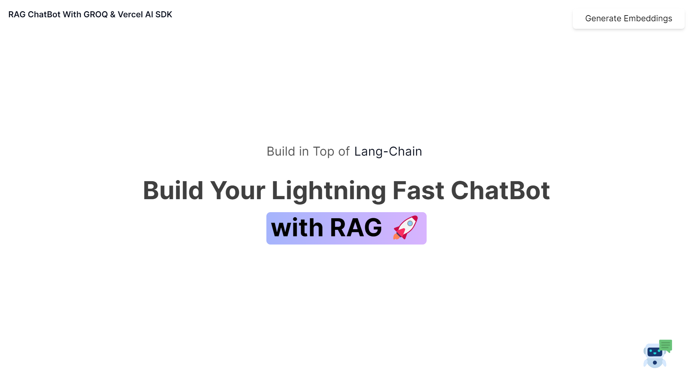

# RAG Chatbot with Next.js and Vercel AI SDK

> **Note:** Google sync of knowledge base working with RAG. BUT, ai is unreliable and inconsistent at knowing what knowledge to access and how to respond or apply the knowledge to its response. Also, lots of hallucinations.

A powerful Retrieval-Augmented Generation (RAG) chatbot built with Next.js and the Vercel AI SDK, using GROQ for language model inference. This system allows you to create a chatbot that can answer questions based on your own documents.



## Table of Contents

- [Features](#features)
- [Getting Started](#getting-started)
  - [Prerequisites](#prerequisites)
  - [Installation](#installation)
  - [Configuration](#configuration)
- [Architecture](#architecture)
- [Development Guide](#development-guide)
  - [Project Structure](#project-structure)
  - [Key Components](#key-components)
  - [Adding New Features](#adding-new-features)
- [Maintenance](#maintenance)
  - [Available Scripts](#available-scripts)
  - [Common Issues and Solutions](#common-issues-and-solutions)
  - [Monitoring](#monitoring)
  - [Automated Maintenance](#automated-maintenance)
- [Deployment](#deployment)
- [Contributing](#contributing)
- [License](#license)

## Features

- 🔍 **Semantic Search**: Utilizes vector embeddings for accurate document retrieval
- 🤖 **AI-Powered Responses**: Generates contextual answers based on your documents
- 🔄 **Google Drive Integration**: Automatically syncs with your Google Drive folder
- 📄 **Multiple File Types**: Supports PDF, DOCX, TXT, and Markdown files
- 🔒 **Privacy-Focused**: Your data stays on your infrastructure
- 🌙 **Dark Mode**: Easy on the eyes, day or night
- 📱 **Responsive Design**: Works on desktop and mobile devices
- 🚀 **Fast Responses**: Powered by Groq's Llama 3 8B model
- 📊 **File Catalog**: Tracks all files and their processing status
- 🔄 **Selective Updates**: Only reprocesses files that have changed
- 📅 **Scheduled Updates**: Supports automated updates via webhooks

## Getting Started

### Prerequisites

- Node.js 18.x or later
- npm or yarn
- Google Cloud account (for Google Drive integration)
- Groq API key
- Upstash Redis and Vector accounts

### Installation

1. Clone the repository:
   ```bash
   git clone https://github.com/yourusername/rag-chatbot-with-vercel-ai-sdk.git
   cd rag-chatbot-with-vercel-ai-sdk
   ```

2. Install dependencies:
   ```bash
   npm install
   # or
   yarn install
   ```

3. Create environment variables:
   ```bash
   cp .env.example .env.local
   ```

4. Start the development server:
   ```bash
   npm run dev
   # or
   yarn dev
   ```

5. Open [http://localhost:3000](http://localhost:3000) in your browser.

### Configuration

Edit the `.env.local` file with your credentials:

```
GROQ_API_KEY=your-groq-api-key
UPSTASH_REDIS_REST_URL=your-redis-url
UPSTASH_REDIS_REST_TOKEN=your-redis-token
UPSTASH_VECTOR_REST_URL=your-vector-url
UPSTASH_VECTOR_REST_TOKEN=your-vector-token
GOOGLE_DRIVE_FOLDER_ID=your-google-drive-folder-id
UNSTRUCTURED_API_KEY=your-unstructured-api-key
SCHEDULED_UPDATE_SECRET=your-secret-key
```

Important notes:

- Enable the Google Drive API in your Google Cloud Console
- Share your Google Drive folder with the service account email
- When creating your vector store, choose the 768 dimension with COSINE metric (`768/COSINE`)
- For local embedding generation, install Ollama and pull the `nomic-embed-text` model:
  ```bash
  ollama pull nomic-embed-text
  ```

## Architecture

The RAG chatbot system consists of several key components:

1. **Document Processing Pipeline**:
   - File ingestion from Google Drive or local uploads
   - Text extraction using specialized loaders for different file types
   - Chunking of text into manageable segments
   - Embedding generation using the nomic-embed-text model
   - Storage of embeddings in Upstash Vector database

2. **Retrieval System**:
   - Semantic search using vector similarity
   - Metadata filtering for more precise results
   - Chunk-level differential updates for efficient processing

3. **Chat Interface**:
   - Real-time streaming responses
   - Markdown rendering
   - Mobile-responsive design
   - Dark mode support

4. **Maintenance System**:
   - File catalog management
   - Error detection and recovery
   - Scheduled updates via webhooks
   - Monitoring dashboard

## Development Guide

### Project Structure

```
rag-chatbot-with-vercel-ai-sdk/
├── src/
│   ├── actions/         # Server actions
│   ├── app/             # Next.js app router
│   ├── assets/          # Static assets
│   ├── components/      # React components
│   ├── helper/          # Helper functions
│   ├── lib/             # Library code (Redis, Vector)
│   ├── loaders/         # Document loaders
│   ├── types/           # TypeScript type definitions
│   └── utils/           # Utility functions
├── scripts/             # Maintenance scripts
├── public/              # Public assets
├── knowledgebase/       # Local document storage
└── .env.local           # Environment variables
```

### Key Components

#### File Catalog

The file catalog (`file-catalog.json`) is a central database that tracks all files in the knowledge base, including:

- File metadata (name, path, size, MIME type)
- Processing status (pending, success, error)
- Chunk information (IDs, hashes)
- Error messages

#### Selective Processing

The system implements selective processing to efficiently update the knowledge base:

1. **Content Hash Tracking**: Files are tracked using SHA-256 content hashes
2. **Change Detection**: Only new, modified, or errored files are processed
3. **Chunk-Level Differential Updates**: Only modified chunks are updated
4. **Intelligent Cache Management**: Redis cache is only refreshed when needed

#### API Routes

- `/api/chat`: Handles chat requests and retrieves relevant documents
- `/api/scheduled-update`: Endpoint for triggering knowledge base updates
- `/api/file-catalog`: Provides information about the file catalog

### Adding New Features

When adding new features to the RAG chatbot:

1. **Document Loaders**: Add new loaders in `src/loaders/` for additional file types
2. **UI Components**: Extend the chat interface in `src/components/`
3. **Server Actions**: Implement new server-side functionality in `src/actions/`
4. **API Routes**: Add new API routes in `src/app/api/`

## Maintenance

### Available Scripts

The `scripts/` directory contains tools for maintaining the RAG chatbot system:

#### `fix-file-errors.js`

Identifies files with processing errors, resets their status, and removes temporary files.

```bash
# Basic usage
node scripts/fix-file-errors.js

# Force processing of all files
node scripts/fix-file-errors.js --force
```

#### `fix-metadata-issues.js`

Targets metadata issues in the file catalog:

```bash
node scripts/fix-metadata-issues.js
```

#### `clean-missing-files.js`

Cleans up missing files from the file catalog:

```bash
# Only remove temporary missing files
node scripts/clean-missing-files.js

# Remove all missing files
node scripts/clean-missing-files.js --remove-all

# Debug mode
node scripts/clean-missing-files.js --debug
```

#### `clean-error-files.js`

Cleans up files with errors from the file catalog:

```bash
# Remove non-existent files with errors
node scripts/clean-error-files.js

# Remove all files with errors
node scripts/clean-error-files.js --remove-all

# Reset processing status for files with errors
node scripts/clean-error-files.js --reset-status
```

#### `inspect-catalog.js`

Inspects the file catalog structure and checks for issues:

```bash
node scripts/inspect-catalog.js
```

#### `maintain-catalog.js`

Performs comprehensive maintenance on the file catalog:

```bash
# Run comprehensive maintenance with all options
node scripts/maintain-catalog.js --remove-all --clean-errors --verbose

# Run maintenance but skip the knowledge base update
node scripts/maintain-catalog.js --skip-update
```

#### `selective-update.js`

Demonstrates the improved knowledge base update process:

```bash
node scripts/selective-update.js
```

#### `generate-dashboard.js`

Generates an HTML dashboard for monitoring the system:

```bash
node scripts/generate-dashboard.js
```

#### `schedule-error-fix.js`

Sets up a file watcher to automatically run the error fix script:

```bash
node scripts/schedule-error-fix.js
```

### Common Issues and Solutions

#### Temporary Files

Temporary files (starting with `~$`) created by Microsoft Office applications can cause issues. The maintenance scripts automatically remove these files from both the filesystem and the catalog.

#### Metadata Size Issues

Some files may have metadata that exceeds the size limit (48KB). The `fix-metadata-issues.js` script reduces the metadata size by:
- Truncating descriptions
- Limiting keywords and content tags
- Removing version history
- Reducing chunk count for very large files

#### Content Extraction Issues

Some files may fail during content extraction. The maintenance scripts reset their processing status so they can be processed again.

#### Missing Files

Files that are referenced in the catalog but don't exist in the knowledgebase can cause confusion. The maintenance scripts either remove these files from the catalog or mark them as errors.

### Monitoring

To monitor the health of your RAG chatbot system:

#### 1. Check the File Catalog Status

Use the `inspect-catalog.js` script to get a quick overview:

```bash
node scripts/inspect-catalog.js
```

#### 2. Generate a Dashboard

Create an HTML dashboard with the `generate-dashboard.js` script:

```bash
node scripts/generate-dashboard.js
```

#### 3. Set Up Logging

Modify the cron jobs to log the output of maintenance scripts:

```bash
# Example with logging
0 2 * * * cd /path/to/rag-chatbot-with-vercel-ai-sdk && node scripts/maintain-catalog.js >> /path/to/logs/maintenance.log 2>&1
```

#### 4. Set Up Email Alerts

Modify the maintenance scripts to send email alerts when issues are detected (requires the `nodemailer` package).

### Automated Maintenance

For automated maintenance, set up cron jobs to run the scripts periodically:

#### Daily Maintenance

```bash
# Run daily at 2 AM
0 2 * * * cd /path/to/rag-chatbot-with-vercel-ai-sdk && node scripts/maintain-catalog.js
```

#### Hourly Error Check

```bash
# Run hourly
0 * * * * cd /path/to/rag-chatbot-with-vercel-ai-sdk && node scripts/fix-file-errors.js
```

#### Weekly Deep Clean

```bash
# Run weekly on Sunday at 3 AM
0 3 * * 0 cd /path/to/rag-chatbot-with-vercel-ai-sdk && node scripts/maintain-catalog.js --remove-all --clean-errors
```

## Deployment

### Vercel Deployment

1. Push your code to a GitHub repository
2. Import the project in Vercel
3. Configure environment variables
4. Deploy

### Self-Hosted Deployment

1. Build the application:
   ```bash
   npm run build
   ```

2. Start the production server:
   ```bash
   npm start
   ```

3. Set up a reverse proxy (Nginx, Apache) to serve the application

### Scheduled Updates

For production deployments, set up a cron job or webhook to trigger the scheduled update endpoint:

```bash
# Using curl with POST
curl -X POST https://your-domain.com/api/scheduled-update \
  -H "Content-Type: application/json" \
  -d '{"secretKey":"your-secret-key"}'
```

## Contributing

Contributions are welcome! Please feel free to submit a Pull Request.

1. Fork the repository
2. Create your feature branch (`git checkout -b feature/amazing-feature`)
3. Commit your changes (`git commit -m 'Add some amazing feature'`)
4. Push to the branch (`git push origin feature/amazing-feature`)
5. Open a Pull Request

## License

This project is licensed under the MIT License - see the LICENSE file for details.
