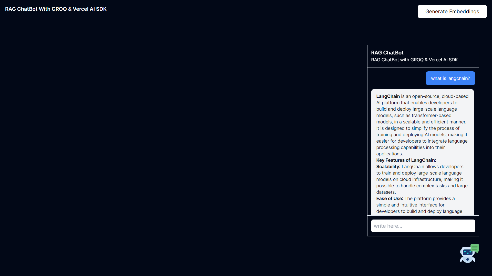

# Basic ChatBot Example

RAG ChatBot setup with Next.js and Vercel AI SDK using the GROQ

---

## 

## Install The node modules

- run `npm install`

## Run the app

- run `npm run dev`

## Environment variables

- Create a `.env` file and copy the conent from `.env.example` to this file
- `GROQ_API_KEY` - Get your groq API key from [Groq Console](https://console.groq.com/)
- `UPSTASH_REDIS_REST_URL` - Get your redis url from [Upstash Console](https://console.upstash.com/)
- `UPSTASH_REDIS_REST_TOKEN` - Get your redis token from [Upstash Console](https://console.upstash.com/)
- `UPSTASH_VECTOR_REST_URL` - Get your vector url from [Upstash Console](https://console.upstash.com/)
- `UPSTASH_VECTOR_REST_TOKEN` - Get your vector token from [Upstash Console](https://console.upstash.com/)
- `GOOGLE_DRIVE_FOLDER_ID` - Get your google drive folder id from [Google Drive Console](https://console.cloud.google.com/drive/folders)

Note:

- Enable the Google Drive API that allows clients to access resources from Google Drive.
- Make sure to Share the folder access with the service account email.
- When creating you vector store - chose the 768 dimension with COSINE metric. `768/COSINE`
- When generating the embeddings - make sure the ollama is running locally and the model `nomic-embed-text` is installed, use the command `ollama pull nomic-embed-text` to pull the model. [Nomic Embed Text](https://ollama.com/library/nomic-embed-text)
